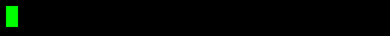

# <center> Hello my nickname is: Rccrawler </center>
### My nickname

**Rccrawler** is my personal online nickname, inspired by my passion for RC vehicles and technology. I created it years ago when I first started programming, and it has remained part of my online identity ever since.

Over the years, I have used **Rccrawler** across my projects, profiles, and different things I have created while learning and working in technology. At this point, it has become more than just a nickname — it is simply the name people know me by online.

Could I change it? Of course. But after all these years, I would probably have to change half my projects, profiles, and paperwork too... so I think **Rccrawler is here to stay.** 😄


     &nbsp; <a href="https://www.codingame.com/profile/d61605888eb599b2f4fc8b1c556cb7736027196"></a>



```java
public class Main {
    public static void main(String[] args) {
        Rccrawler();
    }

    public static void Rccrawler() {
        System.out.println("Name = Rccrawler");
        System.out.println("hobby = Java, operating system, Robotic");
        """
        Higher degree studies in 
        cross-platform application development
        """
        System.out.println("code = ['java', 'HTML', 'CSS', 'python']");
        System.out.println("coding() {}");
        System.out.println("writing() {}");
    }
}
```

<div id="user-content-toc">
  <ul align="center">
    <summary><h2 style="display: inline-block"> Languages and Tools </h2></summary>
  </ul>
</div>

| Category | Icons |
| :--- | :--- |
| **Languages** | <a href="https://skillicons.dev"></a> |
| **Frontend & Backend** | <a href="https://skillicons.dev"></a> |
| **Databases & Cloud** | <a href="https://skillicons.dev"></a> |
| **DevOps & Tools** | <a href="https://skillicons.dev"></a> |
| **Operating Systems** | <a href="https://skillicons.dev"></a> |
| **Software & Design** | <a href="https://skillicons.dev"></a> |
| **Hardware** | <a href="https://skillicons.dev"></a> |

<!--- stats & Languages (start) -->
<p align="center">
    <table align="center">
        <tr border="none">
            <td width="50%" align="center">
                
                <p align="center">
                    <a href="https://github.com/Rccrawler?tab=repositories"><sup>See all projects and details</sup></a>
                </p>
            </td>
        </tr>
    </table>
</p>
<!--- stats (end) -->

<!--- poner un juego directamente en el md -->
<div style="display: flex; justify-content: center; align-items: center;">
  <h2>  &nbsp; Description</h2>
  <h3> </h3>
</div>

I have been working in the technology field since 2023, with a strong interest in computer science, software development, and exploring new technologies.

Throughout my learning and professional journey, I have worked with different tools and technologies, focusing not only on learning how to use them, but also on understanding how they work and how they can be applied to solve real-world problems. I enjoy experimenting, analyzing existing solutions, and learning through hands-on experience.

One of the aspects I value most in the technology industry is continuous learning and collaboration. I believe that sharing knowledge, documenting what we learn, and helping others contributes to building a more open and capable technology community.

I am particularly interested in working on projects where I can continue developing professionally, contribute my knowledge, and take on new technical challenges. I believe that creativity, the ability to learn, and finding effective solutions are essential qualities for professional growth.

I am currently continuing to expand my knowledge and work on personal projects whenever time allows, with the goal of constantly improving my skills and bringing increasing value to the projects I work on.

My professional goal is to continue growing within the technology industry, learn from other professionals, and contribute to projects where technology, creativity, and teamwork play an important role.

---
<p align="center">
  
</p>
